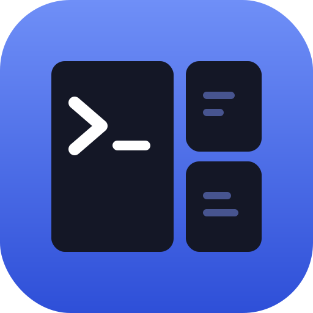
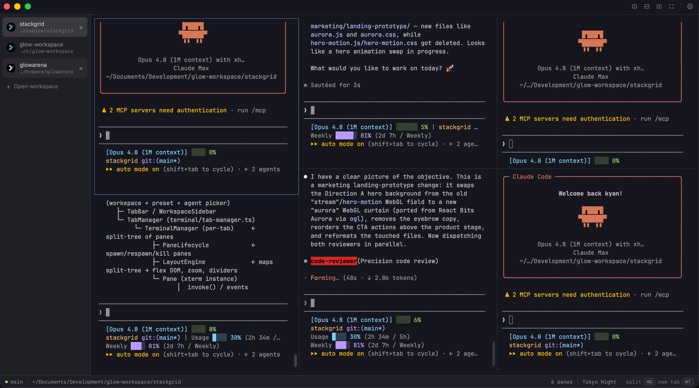

<p align="center">
  
</p>

<h1 align="center">Stackgrid</h1>

<p align="center">
  <a href="LICENSE"></a>
  <a href="https://github.com/mxrsv/stackgrid/releases/latest"></a>
  
  
</p>

> A minimal macOS terminal for AI agent CLIs — split panes, themes, real PTY. Built with Tauri 2, xterm.js and Preact.



## Features

- **Real PTY** — spawns a login shell (`$SHELL -l`) via `portable-pty`, so your PATH, aliases and dotfiles just work.
- **Split panes** — vertical and horizontal splits, drag dividers to resize, keyboard-driven focus cycling.
- **Themes** — Tokyo Night, Dracula, One Dark, Catppuccin Mocha presets with per-color overrides.
- **Persistent settings** — font, theme and layout survive restarts.
- **Lightweight** — native Tauri 2 shell, no Electron.

## Install

1. Download the latest `.dmg` from [Releases](https://github.com/mxrsv/stackgrid/releases/latest).
2. Drag **Stackgrid** into **Applications**.
3. First launch — the app is not signed with an Apple Developer ID yet, so macOS Gatekeeper will warn you. Either:
   - Right-click **Stackgrid.app** → **Open** → **Open**, or
   - Run `xattr -cr /Applications/Stackgrid.app` once.

## Keyboard shortcuts

| Shortcut | Action                     |
| -------- | -------------------------- |
| ⌘D       | Split pane vertically      |
| ⌘⇧D      | Split pane horizontally    |
| ⌘⇧W      | Close pane                 |
| ⌘] / ⌘[  | Focus next / previous pane |

## Build from source

Requires Node.js 20+, Rust (stable) and the Tauri 2 prerequisites for macOS.

```bash
npm install
npm run tauri dev     # development
npm run tauri build   # release build → src-tauri/target/release/bundle/
```

## License

[MIT](LICENSE) © 2026 mxrsv
